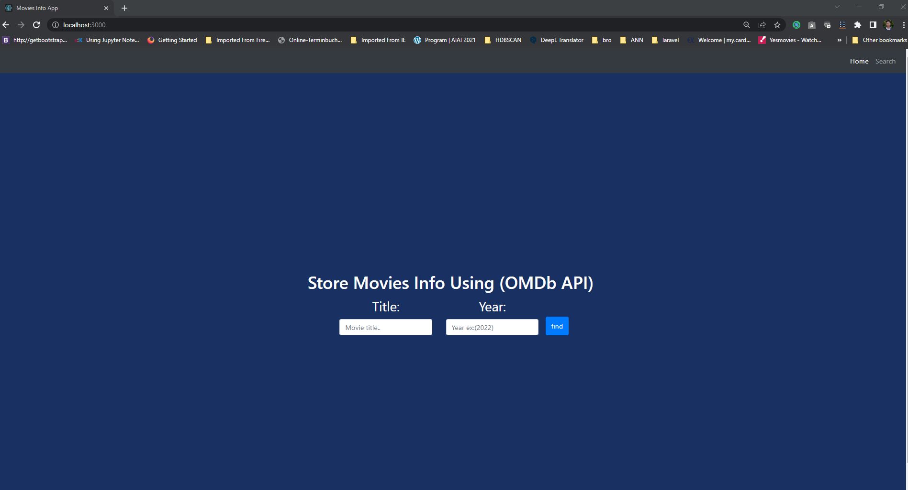
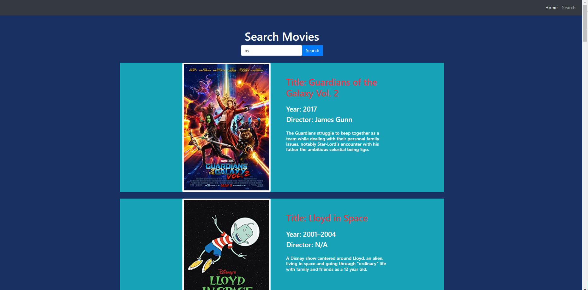
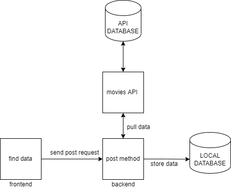
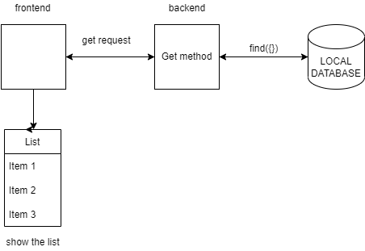
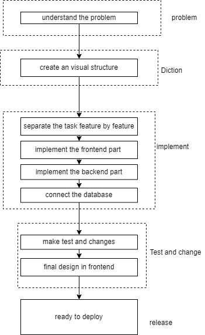

<div id="top"></div>

<!-- PROJECT LOGO -->
<br />
<div align="center">
  <a href="https://github.com/othneildrew/Best-README-Template">
    
  </a>

  <h3 align="center">Movies App</h3>

  <p align="center">
    This is a coding challenge given by meinUnterricht - Talent Acquisition. The goal of this project is to build the frontend with (React js) and the backend with (node js).
  </p>
</div>


<!-- TABLE OF CONTENTS -->
<details>
  <summary>Table of Contents</summary>
  <ol>
    <li>
      <a href="#about-the-project">About The Project</a>
      <ul>
        <li><a href="#built-with">Built With</a></li>
      </ul>
    </li>
    <li>
      <a href="#getting-started">Getting Started</a>
      <ul>
        <li><a href="#prerequisites">Prerequisites</a></li>
        <li><a href="#installation">Installation</a></li>
      </ul>
    </li>
    <li><a href="#usage">Usage</a></li>
    <li><a href="#roadmap">Roadmap</a></li>
    <li><a href="#approaches">Approaches</a></li>

  </ol>
</details>


<!-- ABOUT THE PROJECT -->
## About The Project
<div align="center">

</div>
The project is to create the frontend and backend for getting the information from the movie API (omdbapi.com). The following features are included in this project.

* Pull the data from the movies API (omdbapi.com).
* Store the pull date in the local database (MongoDB)
* Backend is developed using Node js.
* Create frontend using React js.
* Search modules for searching data from local database search fields are title, director, and plot.   
* Show the result including poster, title, year, director, and plot.
* Test case for the system.

<p align="right">(<a href="#top">back to top</a>)</p>


### Built With

This section should list any major frameworks/libraries used to bootstrap your project. Leave any add-ons/plugins for the acknowledgements section. Here are a few examples.

* [Node.js](https://nodejs.org/)
* [React.js](https://reactjs.org/)
* [Bootstrap](https://getbootstrap.com)


<p align="right">(<a href="#top">back to top</a>)</p>


<!-- GETTING STARTED -->
## Getting Started

The project r

### Prerequisites and Run
The app is running in two different the frontend on port 3000 and for backend port on 4000. It's possible to run the two systems separately or combinedly.  To run the system first need to go to the backend folder and the run dev.
* /backend
  ```sh
  cd backend
  ```
* Run the app 
  ```sh
  npm run dev
  ```

<p align="right">(<a href="#top">back to top</a>)</p>


<!-- USAGE EXAMPLES -->
## Usage

In the frontend, there have two parts of navigation  Home and Search. Home has two fields that are required. Using the name of Movies title or parts of the title with a valid year it's possible to pull the data from the movie API and store the data in our local database.

From the Search page, it can be possible to search the specific value match in title, director, and plot from the local database and show the result in the list with the poster. Here is the snapshot of the search page.

<div align="center">

</div>

<p align="right">(<a href="#top">back to top</a>)</p>


<!-- Architecture -->
## Architecture
There has basic structure for the app. Here is the snapshot for the first post and pull method the are exicuted. Frontend send the post method to the backend. Depnding on the serach result it pull the api request to the movie api. Then store the pull date in the local databese.

<div align="center">

</div>

On the search page the send a get request to the backend with api. Then the backend search the value in databese and return them in the frontend as json object. 
<div align="center">

</div>

As software architecture I follow the water fall model. Here I present the architecture of this project devlopment.
<div align="center">

</div>
<p align="right">(<a href="#top">back to top</a>)</p>

<!-- approaches -->
## Approaches
It was a good challenge for me. I have some working experience on javascript node js on a requirement basis. So, It was my first experience working on a full project on javascript. I learn a lot and I love to learn.

Some approaches I take to finish this project.
1. First, learn about reacting and also learn how to work on it.
2. Then design the frontend with react.
3. Create separate components for Home, Nav, and Search.
4. Learn about how to connect the frontend (react) and backend (node js).
5. In the backend, as I already have some work experience so created a separate model and handler(Controller).
6. Then I connect the database with my backend.
7. I face a lot of problems to solve this project. I take help from the internet to clarify my knowledge. 
8. Learn about the unit test and apply it on this app.
9. In that case, I face some problems I find out the problem but with a Lack of knowledge, I didn't solve the issue.
